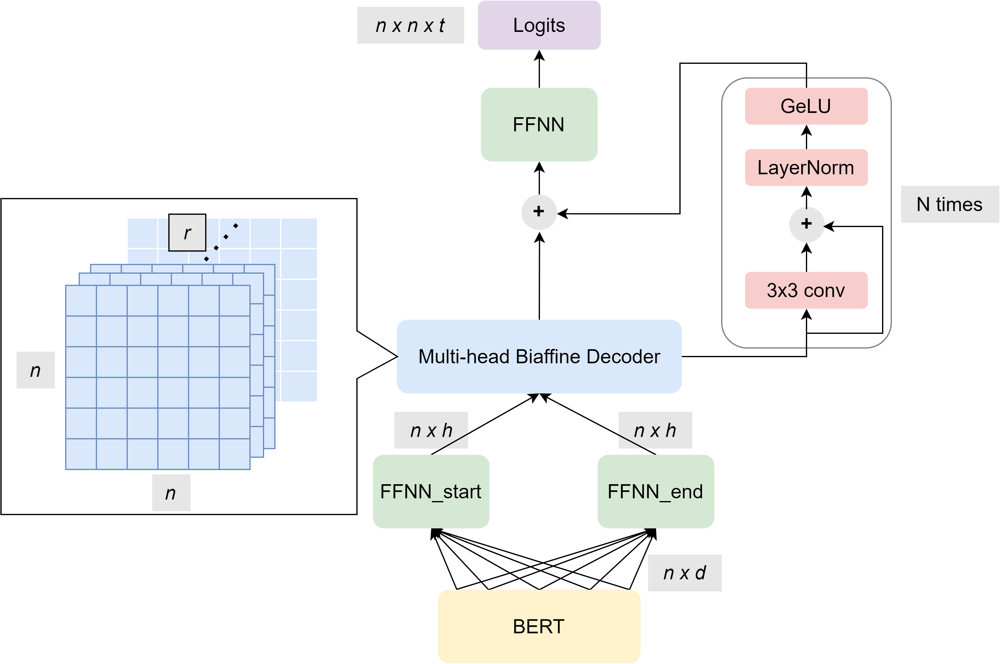
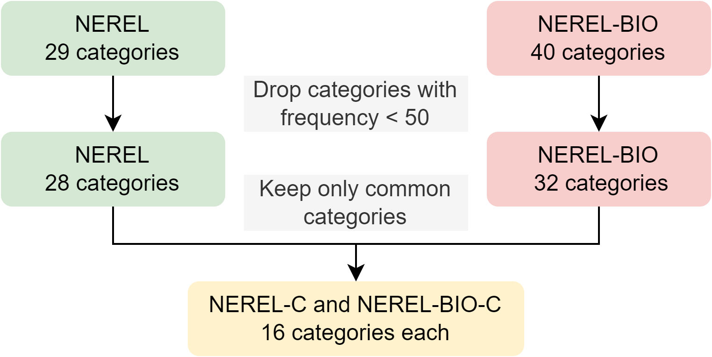

# Cross-Domain-Nested-NER
Proposed method allows cross-domain nested NER without any fine-tuning on target domain data.

## Details:
### Backbone model - [CNN-NER (Yan et al., 2022)]( https://github.com/yhcc/CNN_Nested_NER)

### Cross-domain approach

## Tools and libraries:
- torch == 1.11.0
- fastnlp == 1.0.1

## Datasets:
Source domain: [NEREL (Loukachevitch et al., 2021)](https://arxiv.org/abs/2108.13112)

Target domain: [NEREL-BIO (Loukachevitch et al., 2022)](https://arxiv.org/abs/2210.11913)

## Results and further changes:
Drop in performance compared to the usual training approach (-6.23 % F1 on average per each category). However this approach does not require fine-tuning on target domain dataset. Further improvement could be achieved by utilizing contrastive learning technique to solve category discrepancy between source and target domain datasets.